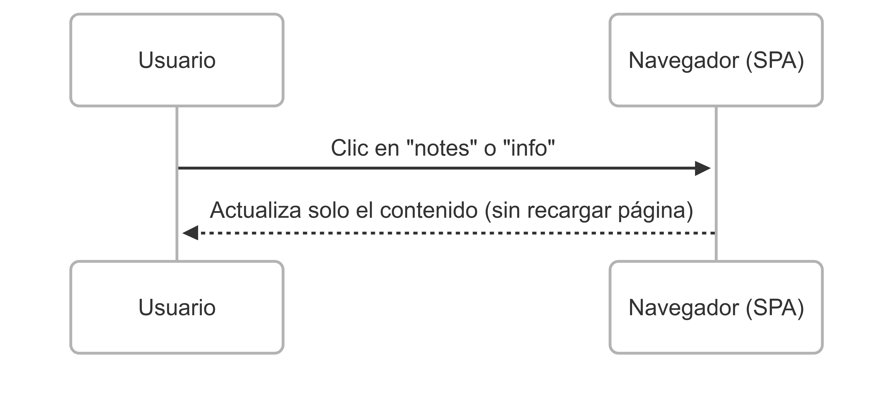
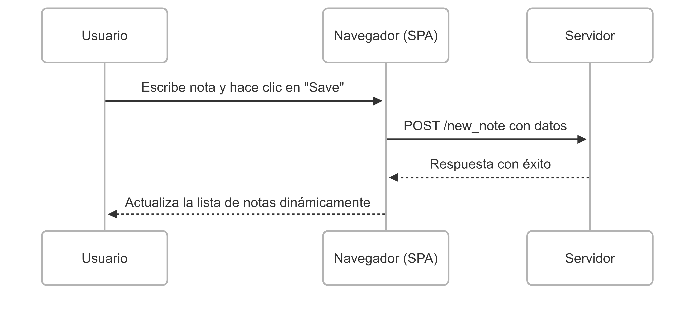

# Parte 0 - Ejercicio 0.4

Este es el diagrama que representa el proceso de guardar una nota en la aplicación web tradicional:

## Ejercicio 0.5

Este diagrama muestra lo que ocurre en una SPA cuando el usuario hace clic en una pestaña sin recargar la página:

## Ejercicio 0.6

Este diagrama representa el flujo de agregar una nueva nota en una SPA:

